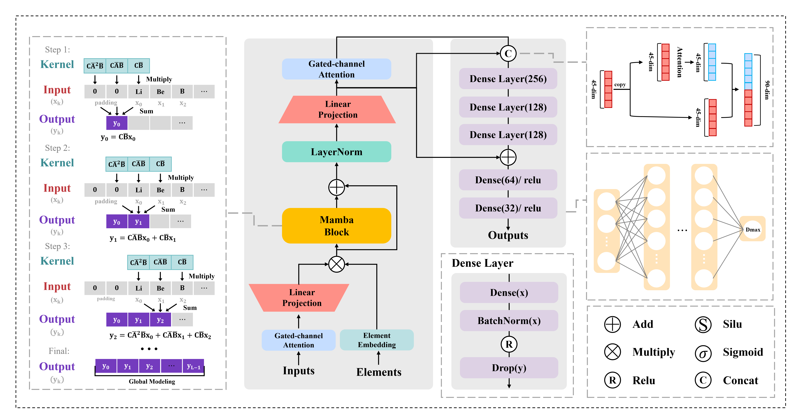

# GA-Mamba
GA-Mamba is a deep-learning framework for predicting the **glass-forming ability (GFA)** of **metallic glasses**, with **Dmax** as the target property.  
This repository provides data preprocessing utilities, optional data augmentation scripts, training/inference code, and the **pretrained model checkpoints** used in our experiments.

## Model Overview

Below are the model architecture.

  

